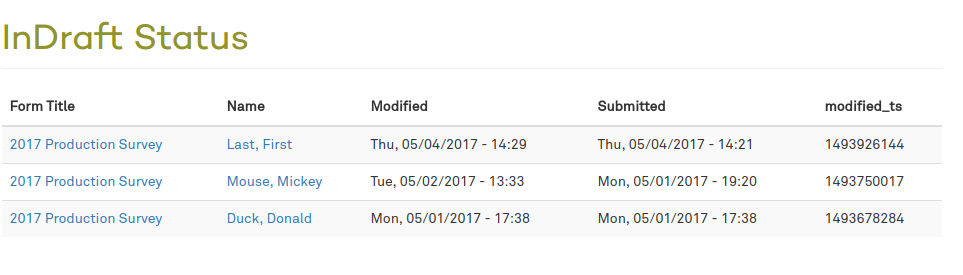

In Draft
=

Issue:
-
We typically launch surveys or other data gathering projects with Drupal 7 webforms. Sometimes clients don't really scale down the length of their forms, forcing us to expose the Save Draft button. People may save drafts but forget to comeback and submit the final copy. 

Solution:
-
This module provides a page with a table report for any given `nid` (or `nid`s) that contains submissions still in a draft status (`is_draft` is `true`) that we can show to non-admins. 



How? 
-
Configured permissions. There is no other configuration. Simply link to `indraft/%` either from another module or in the content. 

```
<a href="indraft/X">See drafts</a>
<a href="indraft/131">See drafts</a>
```
Or to link to multiple node-ids with a comma
```
<a href="indraft/X,Y,Z">See drafts</a>
<a href="indraft/8,1,434">See all drafts</a>
```